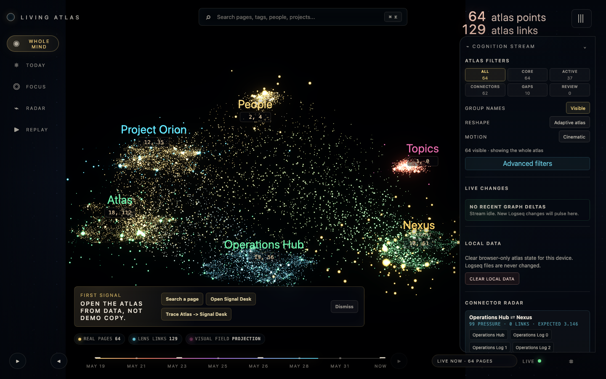
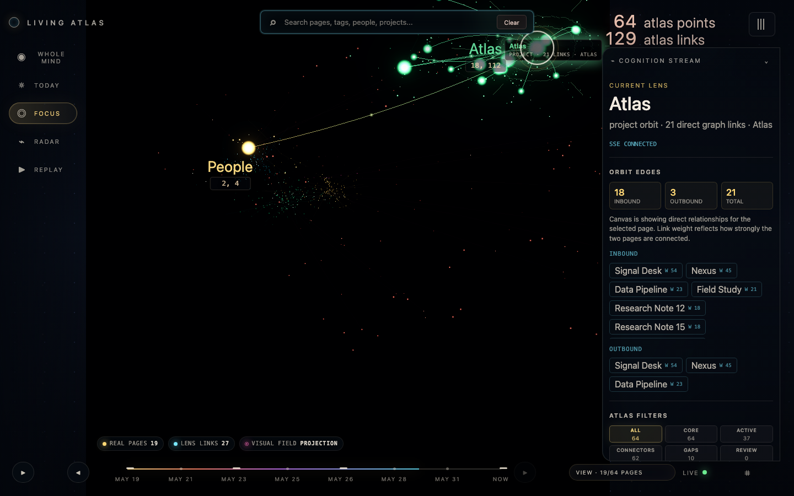
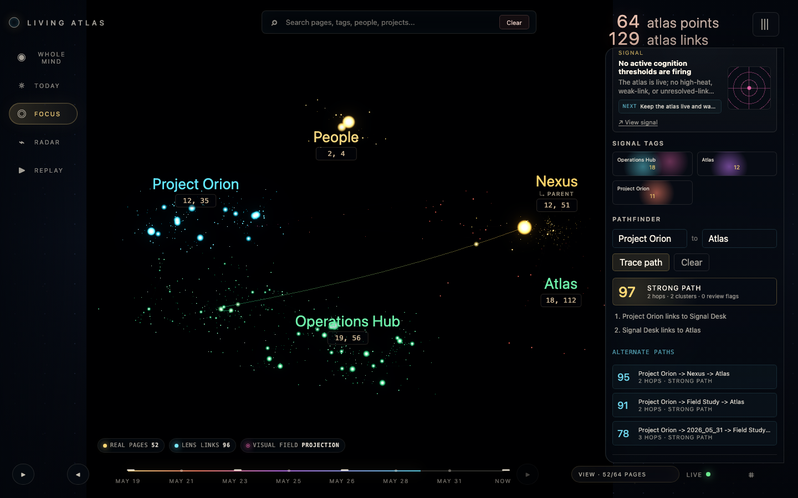
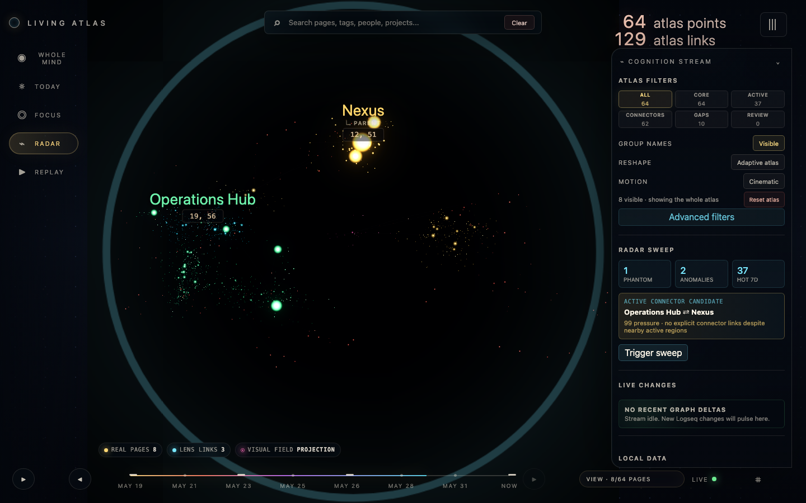

# Living Atlas

Living Atlas turns a local Logseq graph into a read-only, explorable 3D knowledge map. It indexes markdown files from your graph, serves a localhost API, and renders a cinematic Three.js field with clusters, search, focus slices, pathfinding, timeline replay, review flags, and graph-health signals.

The visual goal is science-fiction. The data contract is deliberately boring: every count, label, path, link, and insight must be grounded in the indexed Logseq files.



All screenshots in this README are generated from the public fixture graph.

## Gallery

| Overview | Source Detail |
| --- | --- |
|  |  |

| Pathfinder | Connector Radar |
| --- | --- |
|  |  |

## Contents

- [Try it now](#run-from-github-source)
- [Run from npm](#run-from-npm)
- [Use your own Logseq graph](#use-your-own-logseq-graph)
- [Data and privacy model](#why-trust-it-with-a-graph)
- [Configuration](#configuration)
- [Validation](#validation)
- [Architecture docs](#architecture-docs)

## How To Read The Atlas

- **All** shows the whole indexed graph within the current group, status, confidence, and source filters.
- **Core** keeps high-signal pages and cluster roots visible without assuming a fixed private ontology.
- **Active** shows recently changed pages.
- **Connectors** shows pages that tie otherwise distant graph regions together.
- **Gaps** shows pages with missing source, weak confidence, missing status, or little trusted context.
- **Review** shows pages you flagged locally for cleanup.
- **Timeline replay** filters the graph by page update time so you can watch the visible atlas grow.

Visible group names come from your graph's page types, tags, and inferred clusters. Unknown `source::` values can become filter labels, so use redaction or fixture data for public screenshots.

## Why Trust It With A Graph?

- Local only: the service binds to `127.0.0.1`.
- Read only: Living Atlas never writes to the Logseq graph.
- No cloud dependency: rendering and indexing happen on your machine.
- No Logseq Desktop requirement: the app reads the graph folder directly.
- No absolute paths in normal API responses: source paths are graph-relative by default.
- Generated cache, screenshots, and QA artifacts are graph-derived data and are ignored by default.

Do not expose the service through a reverse proxy or remote tunnel unless you add authentication, transport security, and a deployment-specific threat model.

## Requirements

- Node.js `20.19.0` or newer
- npm
- A local Logseq graph folder for real data runs

The optional companion MCP server is [`logseq-graph-mcp`](https://github.com/johnschieferleuhlenbrock/logseq-graph-mcp). Use it when agents need guarded read/write access to the same graph. Living Atlas itself remains the read-only visualization and index service.

## Release Status

The `0.1.x` line is the first public release series. It is local-first, read-only against your Logseq graph, and intended for individual desktop use while the adapter and MCP integration surfaces stabilize.

## Run From npm

The npm package ships the built UI and local index service.

Try a public fixture without a Logseq graph:

```bash
npx logseq-graph-living-atlas --demo
```

Use your own graph:

```bash
npx logseq-graph-living-atlas --root /absolute/path/to/your/logseq/graph
```

Open the `#token=...` app URL printed by the command. Real graph reads are token-protected by default. The demo fixture stays unauthenticated for easy evaluation.

Useful CLI checks:

```bash
npx logseq-graph-living-atlas --help
npx logseq-graph-living-atlas --version
npx logseq-graph-living-atlas doctor
npx logseq-graph-living-atlas update --check
```

Use `logseq-graph-living-atlas` as the canonical command. The shorter `living-atlas` bin is kept as a convenience alias.

### Maintenance Commands

The Atlas CLI and the companion MCP CLI share the same maintenance shape:

```bash
logseq-graph-living-atlas doctor [--root /path/to/logseq] [--json]
logseq-graph-living-atlas update [--check|--dry-run|--apply] [--channel latest] [--json]
```

`doctor` validates the local runtime, package metadata, install mode, packaged UI build, and optional graph root.

`update` checks npm release metadata and prints install-mode-aware guidance. `--channel` defaults to `latest`; when another npm dist-tag is selected, package and npx guidance use that same tag:

- source checkout: `git pull && npm install && npm run check`
- npx execution: `npx logseq-graph-living-atlas@<channel>`
- npm package install: `npm install -g logseq-graph-living-atlas@<channel>`

Actual mutation requires `update --apply` plus `LOGSEQ_UPDATE_ALLOW_APPLY=1`. Source checkouts and npx runs refuse in-place mutation.

`--root` must point at the graph folder, not the `pages/` folder itself.

## Run From GitHub Source

```bash
git clone https://github.com/johnschieferleuhlenbrock/logseq-graph-living-atlas.git
cd logseq-graph-living-atlas
npm install
```

### Try The Demo

The demo creates a public-safe fixture graph in the OS user cache at runtime, builds the app, and serves it locally.

```bash
npm run demo
```

Open `http://127.0.0.1:8787`.

No demo graph files are committed. Repo-local build and QA artifacts can be removed with:

```bash
npm run clean
```

Remove user-cache demo graphs too:

```bash
npm run clean -- --user-cache
```

Regenerate the README screenshot from the same fixture data:

```bash
npm run capture:demo
```

### Optional MCP Compatibility Smoke

This verifies that the published `logseq-graph-mcp` package and Living Atlas can both read the same generated fixture graph:

```bash
npm run smoke:mcp
```

By default the smoke uses `npx logseq-graph-mcp@0.1.2`. To test a local MCP checkout instead:

```bash
LOGSEQ_GRAPH_MCP_CLI=/absolute/path/to/logseq-graph-mcp/dist/cli.js npm run smoke:mcp
```

Regenerate the full README gallery:

```bash
npm run capture:demo -- --gallery
```

### Use Your Own Logseq Graph

`--root` must point at the graph folder, not the `pages/` folder itself. A valid graph root looks like this:

```text
my-logseq-graph/
  pages/
    Example.md
  journals/
    2026_05_31.md
```

Quick preflight:

```bash
ls /absolute/path/to/your/logseq/graph/pages
```

Common macOS locations include `~/Documents`, `~/Library/Mobile Documents`, or a synced folder such as iCloud, Dropbox, or OneDrive. Windows and Linux paths work too; pass the absolute folder that contains `pages/`.

```bash
npm run build
npm run serve -- --root /absolute/path/to/your/logseq/graph
```

Open the token URL printed by the service, usually `http://127.0.0.1:8787/#token=...`.

For split frontend/API development:

```bash
LIVING_ATLAS_TOKEN=<random-local-token> npm run dev:api -- --root /absolute/path/to/your/logseq/graph --allowed-origin http://127.0.0.1:5177
npm run dev
```

Open `http://127.0.0.1:5177/#token=<random-local-token>`.

The Vite dev server proxies `/api` to `127.0.0.1:8787`. Use `--allow-unauthenticated-read` only for trusted local experiments with non-sensitive fixture data.

PowerShell example:

```powershell
npm run serve -- --root "D:\LogseqGraph" --token "replace-with-a-random-local-token"
```

## Configuration

You can use command-line arguments, shell environment variables, or Node's env-file support.

```bash
cp .env.example .env.local
node --env-file=.env.local server/brain-service.mjs --watch --static dist
```

Supported settings:

| Setting | Purpose | Default |
| --- | --- | --- |
| `LOGSEQ_ROOT` / `--root` | Logseq graph folder | Required |
| `LIVING_ATLAS_PORT` / `--port` | Local HTTP port | `8787` |
| `LIVING_ATLAS_CACHE` / `--cache` | Snapshot cache outside the graph | OS user cache directory |
| `LIVING_ATLAS_TOKEN` / `--token` | Local API token; generated for real graph CLI runs when omitted | Empty in demo mode |
| `LIVING_ATLAS_REQUIRE_TOKEN=1` / `--require-token` | Require the token for every `/api/*` route | On for CLI real-graph runs |
| `LIVING_ATLAS_ALLOW_UNAUTHENTICATED_READ=1` / `--allow-unauthenticated-read` | Allow local API reads without a token | Off |
| `LIVING_ATLAS_ALLOW_UNAUTHENTICATED_REINDEX=1` / `--allow-unauthenticated-reindex` | Allow manual reindex without a token for local development | Off |
| `LIVING_ATLAS_ALLOWED_ORIGINS` / `--allowed-origin` | Comma-separated local origins allowed to read the API outside same-origin mode | Empty |
| `LIVING_ATLAS_DEBUG_PATHS=1` / `--debug-paths` | Include absolute diagnostic paths in `/api/health` | Off |
| `LIVING_ATLAS_MAX_FILES` | Maximum markdown files accepted during ingest | `250000` |
| `LIVING_ATLAS_MAX_FILE_BYTES` | Maximum bytes per markdown file during ingest | `2097152` |

The service refuses to write its cache inside `LOGSEQ_ROOT`. Cache files are derived graph data; treat them as sensitive unless they were generated from the public fixture.

### Token-Protected Local UI

Real graph runs enable read-token mode by default. Provide a token yourself or use the generated session token printed by the service:

```bash
npx logseq-graph-living-atlas --root /absolute/path/to/your/logseq/graph --token <your-token> --require-token
```

Then open:

```text
http://127.0.0.1:8787/#token=<your-token>
```

The fragment is not sent in the initial HTTP request. The browser stores it in session storage, strips it from the visible URL, and sends API reads with an `Authorization: Bearer <token>` header. The SSE stream uses the documented `/api/events?token=...` fallback because native `EventSource` cannot send custom headers.

## Logseq Compatibility

Current support:

| Graph area | Status |
| --- | --- |
| `pages/**/*.md` | Indexed |
| `journals/**/*.md` | Indexed |
| Wikilinks `[[Page]]` | Indexed as graph links |
| Properties like `type:: project` | Parsed |
| Typed markdown links like `Owner: [[Page]]` | Parsed |
| Assets, queries, block refs, and advanced Logseq syntax | Best effort only |

The parser is intentionally isolated and covered by fixture tests, but it is not a full Logseq database implementation.

## API

The service binds to `127.0.0.1` and rejects non-loopback peers. See `docs/API.md` for schemas, query ranges, SSE frames, and error semantics.

```bash
curl -H "Authorization: Bearer <your-token>" http://127.0.0.1:8787/api/health
curl -H "Authorization: Bearer <your-token>" "http://127.0.0.1:8787/api/path?from=Atlas&to=Signal%20Desk"
```

## Keyboard Exploration

The atlas can be driven without leaving the graph field:

| Shortcut | Action |
| --- | --- |
| `Ctrl+K` / `Cmd+K` | Focus command search |
| `1`..`5` | Switch Whole Mind, Today, Focus, Radar, Replay |
| `Esc` | Clear the active lens and return to Whole Mind |
| `Left` / `Right` | Step replay backward or forward while Replay is active |

Endpoints:

- `GET /api/health`
- `GET /api/snapshot`
- `GET /api/search?q=<page-or-tag>`
- `GET /api/focus?q=<page>`
- `GET /api/node?q=<page>`
- `GET /api/path?from=<page>&to=<page>`
- `GET /api/connectors`
- `GET /api/bridges` deprecated alias for connectors
- `GET /api/delta`
- `GET /api/events`
- `POST /api/reindex`

`POST /api/reindex` requires either `Authorization: Bearer <token>` or `x-living-atlas-token: <token>` unless `--allow-unauthenticated-reindex` is enabled for local development. CLI real-graph runs protect read routes by default; `--allow-unauthenticated-read` is the explicit local-development opt-out.

## Validation

```bash
npx playwright install chromium
npm test
npm run check:runtime
npm run eval
npm run test:ui
npm run test:ui:scale
npm run check:public
```

`npm run eval` covers both synthetic 1k/10k/100k graph generation and a 10k-file local service disk/API/reindex path. `npm run test:ui:scale` verifies browser rendering for 10k and budgeted 100k atlas payloads.

For heavier local proof outside normal CI, run the opt-in disk/watch service evaluation:

```bash
npm run eval:service:100k
```

Or run the full gate:

```bash
npm run validate
```

The UI smoke test uses a generated fixture graph and writes screenshots to a temporary directory unless `LIVING_ATLAS_QA_DIR` is set.

## Repository Policy

Target `main` for all public work. Do not create or target any alternate default branch.

Do not commit real graph data or graph-derived artifacts. These paths are intentionally ignored:

- `.cache/`
- `dist/`
- `docs/qa/`
- `.env`
- `.env.local`
- `.public-readiness.local.json`

Contributor validation:

```bash
npm run clean
npx playwright install chromium
npm run validate
npm audit --audit-level=moderate
npm pack --dry-run
npm run smoke:package
```

Maintainer release validation:

```bash
npm run clean
npm run validate
npm audit --audit-level=moderate
npm pack --dry-run
npm run smoke:package
npm run check:release
```

For publish rehearsal, `npm pack --dry-run` intentionally runs the production build. Use `npm pack --dry-run --ignore-scripts` only when you want to inspect the package allowlist without regenerating `dist/`.

First publish policy: create a `vX.Y.Z` tag matching `package.json` on `origin/main` and let the protected GitHub Release workflow publish with npm provenance. Emergency manual publish is documented in `docs/RELEASE.md`.

```bash
git tag v0.1.0
git push origin main v0.1.0
```

## Architecture

See `docs/ARCHITECTURE.md`, `docs/API.md`, `docs/ADAPTERS.md`, `docs/REPO_GUIDE.md`, `docs/CONCEPTS.md`, `docs/MCP.md`, `docs/TROUBLESHOOTING.md`, and `docs/RELEASE.md`.

Short version:

- Logseq markdown is the source of truth.
- The Local Index Service owns parsing, cache, budgets, deltas, and graph APIs.
- React and Three.js own rendering and interaction.
- Guarded writes belong in a separate MCP/writeback layer.
